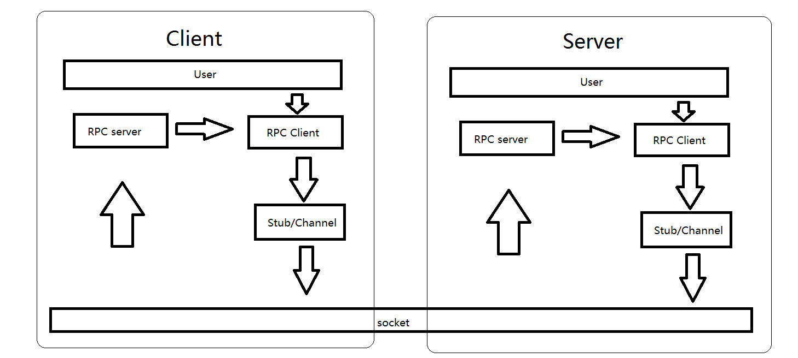

基于boost.asio网络模块和protobuf通信描述的RPC实现
==

##1 RPC实现框架
目前实现的RPC只能一端的RPC client调用另一端的RPC service，没有返回值。如果需要返回值，另一端调用这一端的RPC，以参数作为返回值。

RPC分为client和service，client以protobuf的stub/channel形式实现，rpc server以service实现。

网络通信的服务端和客户端，都包括了RPC的服务端和客户端，RPC的客户端通过网络通信调用RPC服务端。

框架如下：

比如客户端发起RPC调用，步骤如下：
1. 调用proxy中RPC封装函数
2. proxy配置request的相关信息，调用channel的CallMethod。
3. RpcChannel在CallMethod需要配置要调用的func和service信息，以及把request序列化为字符串。
4. 通过socket把包含func/service/request序列化的字符串发到服务器。
5. 服务器收到字符串，解析字符串中的func和service信息，然后调用相关service的RPC function。
6. 如果该RPC function完成后需要调用客户端的RPC，那么调用proxy中的RPC封装即可。

##2 模块构成
- TcpConnect：分为客户端和服务端，负责网络通信。
- RpcChannel：protobuf定义，RPC client端使用，最重要的是CallMethod，将信息序列化，使用socket发送。
- RpcProxy：封装Rpc调用，供上层（使用rpc的客户代码）和Rpc service调用。
- RPCServerService：RPC服务端，等待RPC客户端调用。

##3 基于protobuf实现RPC流程
参考：
http://blog.csdn.net/kevinlynx/article/details/39379957

其中有个问题：如何标示service和method。文中的方法太复杂。

我的方法是，使用serviceId和functionId，将其放在要传输的字符串首部，到了服务端进行解析即可。

目前，我只是用了functionId。放在网络传输字符串的第一个字节。
